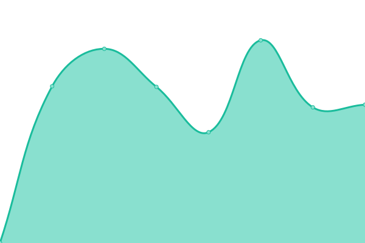

# [📈 Live Status](https://eifinger.github.io/upptime): <!--live status--> **🟩 All systems operational**

This repository contains the open-source uptime monitor and status page for [Kevin Stillhammer](https://blog.kevineifinger.de), powered by [Upptime](https://github.com/upptime/upptime).

With [Upptime](https://upptime.js.org), you can get your own unlimited and free uptime monitor and status page, powered entirely by a GitHub repository. We use [Issues](https://github.com/eifinger/upptime/issues) as incident reports, [Actions](https://github.com/eifinger/upptime/actions) as uptime monitors, and [Pages](https://eifinger.github.io/upptime) for the status page.

<!--start: status pages-->
<!-- This summary is generated by Upptime (https://github.com/upptime/upptime) -->
<!-- Do not edit this manually, your changes will be overwritten -->
<!-- prettier-ignore -->
| URL | Status | History | Response Time | Uptime |
| --- | ------ | ------- | ------------- | ------ |
|  [Home Assistant](https://homeassistant.kevinstillhammer.de) | 🟩 Up | [home-assistant.yml](https://github.com/eifinger/upptime/commits/HEAD/history/home-assistant.yml) | 

 647ms
     
 | 

<a href="https://eifinger.github.io/upptime/history/home-assistant">99.63%</a>
    

|  [Seafile](https://seafile.kevinstillhammer.de) | 🟩 Up | [seafile.yml](https://github.com/eifinger/upptime/commits/HEAD/history/seafile.yml) | 

 844ms
     
 | 

<a href="https://eifinger.github.io/upptime/history/seafile">99.63%</a>
    

|  [Standard Notes](https://notes.kevinstillhammer.de) | 🟩 Up | [standard-notes.yml](https://github.com/eifinger/upptime/commits/HEAD/history/standard-notes.yml) | 

 625ms
     
 | 

<a href="https://eifinger.github.io/upptime/history/standard-notes">99.63%</a>
    

|  [PhotoPrism](https://photoprism.kevinstillhammer.de) | 🟩 Up | [photo-prism.yml](https://github.com/eifinger/upptime/commits/HEAD/history/photo-prism.yml) | 

 666ms
     
 | 

<a href="https://eifinger.github.io/upptime/history/photo-prism">99.63%</a>
    

|  [Jellyfin](https://jellyfin.kevinstillhammer.de) | 🟩 Up | [jellyfin.yml](https://github.com/eifinger/upptime/commits/HEAD/history/jellyfin.yml) | 

 697ms
     
 | 

<a href="https://eifinger.github.io/upptime/history/jellyfin">99.63%</a>
    

<!--end: status pages-->

[**Visit our status website →**](https://eifinger.github.io/upptime)

## 📄 License

- Powered by: [Upptime](https://github.com/upptime/upptime)
- Code: [MIT](./LICENSE) © [Kevin Stillhammer](https://blog.kevineifinger.de)
- Data in the `./history` directory: [Open Database License](https://opendatacommons.org/licenses/odbl/1-0/)
